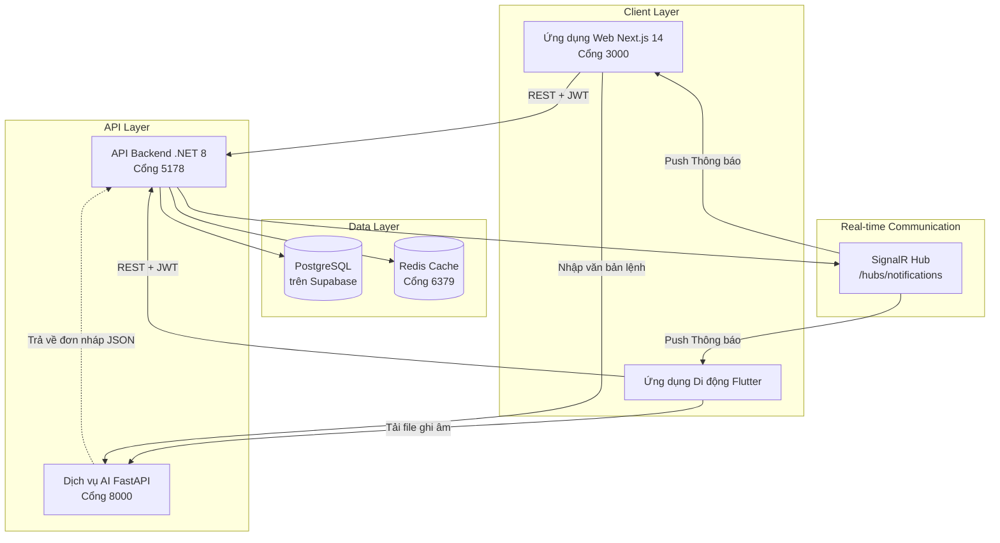

# BizFlow Platform

> **Hệ thống Quản lý Bán hàng Thông minh** — Nền tảng SaaS tối ưu hóa hoạt động bán hàng, quản lý kho và công nợ dành riêng cho các hộ kinh doanh cá thể và cửa hàng bán lẻ tại Việt Nam. Hệ thống tự động hóa hạch toán sổ sách kế toán tuân thủ nghiêm ngặt **Thông tư 88/2021/TT-BTC** và tích hợp trợ lý ảo AI nhận diện giọng nói tiếng Việt.

---

## Mục lục

- [Tổng quan dự án](#tổng-quan-dự-án)
- [Các tính năng chính](#các-tính-năng-chính)
- [Cấu trúc Monorepo](#cấu-trúc-monorepo)
- [Công nghệ sử dụng](#công-nghệ-sử-dụng)
- [Sơ đồ kiến trúc](#sơ-đồ-kiến-trúc)
- [Yêu cầu hệ thống](#yêu-cầu-hệ-thống)
- [Biến môi trường](#biến-môi-trường)
- [Triển khai với Docker](#triển-khai-với-docker)
- [Phát triển cục bộ](#phát-triển-cục-bộ)
- [Danh sách URL dịch vụ](#danh-sách-url-dịch-vụ)
- [Thiết lập Cơ sở dữ liệu](#thiết-lập-cơ-sở-dữ-liệu)
- [Xác thực & Phân quyền](#xác-thực--phân-quyền)
- [Dịch vụ trợ lý AI](#dịch-vụ-trợ-lý-ai)
- [Ứng dụng di động](#ứng-dụng-di-động)
- [Quy trình phát triển](#quy-trình-phát-triển)
- [Lưu ý triển khai](#lưu-ý-triển-khai)
- [Hướng dẫn xử lý sự cố](#hướng-dẫn-xử-lý-sự-cố)
- [Bản quyền](#bản-quyền)

---

## Tổng quan dự án

BizFlow Platform giải quyết hai bài toán cốt lõi của hộ kinh doanh cá thể tại Việt Nam:

1. **Số hóa quy trình thủ công:** Thay thế hoàn toàn việc ghi chép sổ sách bằng tay hoặc các bảng tính Excel rời rạc bằng một hệ thống POS quản lý bán hàng tại quầy, quản lý kho và theo dõi công nợ khách hàng tập trung.
2. **Tự động hóa báo cáo thuế:** Mỗi khi một đơn hàng bán ra hoặc phiếu nhập kho được xác nhận, hệ thống tự động ghi bút toán vào 3 loại sổ sách kế toán bắt buộc: Sổ doanh thu (S1-ĐH), Sổ kho (S2-ĐH), và Sổ chi phí (S3-ĐH) theo đúng quy định của Thông tư 88/2021/TT-BTC.

Hệ thống tích hợp công nghệ AI (chuyển đổi giọng nói thành đơn nháp) giúp nhân viên và chủ cửa hàng tạo đơn hàng nhanh chóng chỉ bằng các câu lệnh nói tiếng Việt tự nhiên.

---

## Các tính năng chính

### Quản trị viên Nền tảng (Platform Administrator)
- Phê duyệt, kích hoạt hoặc khóa tài khoản của các hộ kinh doanh (Tenants).
- Quản lý và cấu hình các gói cước thuê bao hệ thống (Miễn phí, Cơ bản, Chuyên nghiệp).
- Theo dõi biểu đồ doanh thu và lượng giao dịch trên toàn hệ thống.
- Cấu hình và cập nhật các biểu mẫu báo cáo thuế đáp ứng các thay đổi về mặt pháp lý.

### Chủ cửa hàng (Store Owner)
- **Bảng điều khiển (Dashboard):** Xem thống kê doanh thu, sản phẩm bán chạy, cảnh báo tồn kho sắp hết, và tổng nợ phải thu.
- **Quản lý sản phẩm:** Thiết lập thuộc tính hàng hóa, định nghĩa nhiều đơn vị tính (DVT) quy đổi tương ứng với giá bán lẻ khác nhau (ví dụ: Lon / Lốc / Thùng).
- **Quản lý kho:** Lập phiếu nhập kho, theo dõi lịch sử nhập - xuất - tồn chi tiết từng mặt hàng.
- **Quản lý công nợ:** Thiết lập hạn mức nợ cho khách hàng, theo dõi chi tiết lịch sử mua nợ và ghi nhận các khoản thu nợ.
- **Quản lý nhân viên:** Cấp tài khoản cho nhân viên thu ngân, theo dõi nhật ký hoạt động (Audit logs) của nhân viên.
- **Chấm công & Tính lương:** Quản lý ca làm việc, chấm công vào ca/kết ca của nhân viên và tổng hợp bảng lương tự động.
- **Sổ sách Thông tư 88:** Tự động tổng hợp và xuất bản các mẫu sổ S1-ĐH, S2-ĐH, S3-ĐH dưới dạng bảng biểu hoặc xuất file PDF.

### Nhân viên bán hàng (Employee)
- **POS tại quầy:** Giao diện bán hàng tối ưu, tìm kiếm sản phẩm nhanh qua tên viết tắt hoặc quét mã vạch (Barcode), chọn đơn vị quy đổi linh hoạt.
- **Phương thức thanh toán:** Tiền mặt, Chuyển khoản ngân hàng, hoặc Ghi nợ khách hàng thân thiết.
- **Duyệt đơn hàng nháp từ AI:** Nhận thông báo thời gian thực khi trợ lý ảo AI khởi tạo đơn hàng từ giọng nói, kiểm tra lại danh sách hàng và nhấn xác nhận để xuất hóa đơn.
- **Chấm công:** Thực hiện Check-in / Check-out ca làm việc trực tiếp trên thiết bị di động có xác thực vị trí.

### Trợ lý giọng nói AI
- Thu âm giọng nói của nhân viên -> gửi file âm thanh lên AI service -> chuyển ngữ sang tiếng Việt -> trích xuất thông tin (Tên khách hàng, Sản phẩm, Số lượng, Hình thức thanh toán) -> khởi tạo đơn hàng nháp.
- **Cơ chế dự phòng an toàn (Fail-safe):** Dịch vụ trợ lý ảo AI là một thành phần tùy chọn bổ trợ. Nếu dịch vụ AI gặp sự cố hoặc mất kết nối, toàn bộ hoạt động bán hàng thủ công tại quầy và các nghiệp vụ quản lý kho của hệ thống POS vẫn hoạt động bình thường, không gây gián đoạn kinh doanh.
- Để tránh sai sót, toàn bộ đơn hàng do AI tạo ra đều nằm ở trạng thái đơn nháp và bắt buộc phải được con người kiểm tra, phê duyệt thủ công trước khi ghi nhận vào sổ sách kế toán hay trừ kho.

---

## Cấu trúc Monorepo

```
BizFlow-Flatform/
├── docker-compose.yml          # Kịch bản khởi chạy toàn bộ 6 dịch vụ hệ thống
├── database/
│   └── init.sql                # File bootstrap khởi tạo schema cho database cục bộ (Chỉ dùng cho môi trường phát triển)
├── frontend/                   # Ứng dụng Web POS & Dashboard (Next.js 14, TypeScript)
│   ├── Dockerfile
│   ├── package.json
│   └── src/
├── backend/                    # API dịch vụ nền tảng (.NET 8 Clean Architecture)
│   ├── BizFlow.sln
│   ├── run_backend.bat         # File script hỗ trợ chạy hot-reload trên Windows
│   └── src/
│       ├── BizFlow.Domain/         # Thực thể, Enum, Hằng số nghiệp vụ
│       ├── BizFlow.Application/    # Khai báo Interface, DTO, hợp đồng dịch vụ
│       ├── BizFlow.Infrastructure/ # DbContext, Cài đặt dịch vụ, Migrations, Seeders
│       ├── BizFlow.WebApi/         # Controllers, SignalR Hubs, cấu hình khởi chạy
│       └── BizFlow.Tests/
├── ai-service/                 # Dịch vụ xử lý giọng nói và trích xuất thực thể (FastAPI)
│   ├── Dockerfile
│   ├── requirements.txt
│   └── main.py
└── mobile/                     # Ứng dụng di động dành cho nhân viên (Flutter)
    └── pubspec.yaml
```

---

## Công nghệ sử dụng

| Tầng dịch vụ | Công nghệ sử dụng | Phiên bản |
|---|---|---|
| **Frontend** | Next.js | `^14.2.3` |
| | TypeScript | `^5.4.5` |
| | Tailwind CSS | `^3.4.3` |
| | TanStack Query | `^5.39.0` |
| | SignalR Client | `@microsoft/signalr ^10.0.0` |
| | Supabase JS Client | `@supabase/supabase-js ^2.108.2` |
| | Biểu đồ | Recharts `^2.12.7` |
| **Backend** | .NET SDK | 8.0 |
| | Entity Framework Core | 8.0.6 |
| | Trình điều khiển PostgreSQL | Npgsql `8.0.4` |
| | Xác thực hệ thống | JWT Bearer Authentication `8.0.6` |
| | Mã hóa mật khẩu | BCrypt.Net-Next `4.0.3` |
| | Kết nối thời gian thực | ASP.NET Core SignalR |
| | Quản lý bộ nhớ đệm | StackExchange.Redis `8.0.6` |
| **AI Service** | Framework | FastAPI `0.111.0` |
| | Web Server | Uvicorn `0.30.1` |
| | Chuyển đổi giọng nói | OpenAI Whisper `20231117` (Chạy cục bộ, mô hình base) |
| | Trích xuất thực thể | Google Gemini API (qua thư viện `google-genai`) |
| | Vector Database | ChromaDB `0.5.0` |
| | Môi trường Python | 3.11 |
| **Mobile** | Framework di động | Flutter |
| | Dart SDK | `>=3.0.0 <4.0.0` |
| | Ghi âm giọng nói | `record ^6.0.0` |
| | Lưu trữ bảo mật | `flutter_secure_storage ^9.2.2` |
| **Database** | Hệ quản trị CSDL | PostgreSQL 16 |
| | Môi trường chính thức | Hosted PostgreSQL (Supabase) |
| | Môi trường phát triển | Docker `postgres:16-alpine` (Tùy chọn) |
| **Cache** | Redis | 7 (`redis:7-alpine`) |

---

## Sơ đồ kiến trúc



---

## Yêu cầu hệ thống

Trước khi bắt đầu cài đặt và khởi chạy dự án, hãy đảm bảo hệ thống của bạn đã cài đặt các công cụ sau:

| Công cụ | Phiên bản tối thiểu | Mục đích sử dụng |
|---|---|---|
| Docker Desktop | Mới nhất | Triển khai nhanh toàn bộ dự án qua container (Khuyên dùng) |
| .NET SDK | 8.0 | Phát triển cục bộ tầng Backend |
| Node.js | 18+ | Phát triển cục bộ tầng Frontend |
| Python | 3.11 | Phát triển cục bộ dịch vụ AI |
| `ffmpeg` | Bất kỳ | Thư viện xử lý file âm thanh cho Whisper (Đã tích hợp sẵn trong Docker) |
| Flutter SDK | ≥3.0 (Tương thích Dart SDK) | Phát triển ứng dụng di động Mobile |

---

## Biến môi trường

### 1. Cấu hình Backend

Bạn có thể ghi đè các cấu hình sau thông qua biến môi trường hoặc tệp `appsettings.json`:

| Tên biến | Bắt buộc | Mô tả | Giá trị mặc định (Local) |
|---|---|---|---|
| `ConnectionStrings__DefaultConnection` | **Có** | Chuỗi kết nối PostgreSQL | `Host=localhost;Port=5432;Database=bizflow_db;Username=postgres;Password=postgres` |
| `ConnectionStrings__RedisConnection` | **Có** | Chuỗi kết nối Redis | `localhost:6379` |
| `JwtSettings__SecretKey` | **Có** | Khóa ký JWT token (Cần thay đổi khi lên production) | Khóa mặc định trong `appsettings.json` |
| `JwtSettings__Issuer` | Không | Đơn vị phát hành JWT | `BizFlow.WebApi` |
| `JwtSettings__Audience` | Không | Đối tượng sử dụng JWT | `BizFlow.Frontend` |
| `JwtSettings__ExpiryMinutes` | Không | Thời gian hết hạn JWT (phút) | `1440` (24 giờ) |
| `EnableDevSeed` | Dev | Thiết lập `true` để tự động tạo dữ liệu tài khoản test khi chạy dev | `false` |

### 2. Cấu hình Frontend

Tạo tệp cấu hình `frontend/.env.local`:

| Tên biến | Bắt buộc | Mô tả |
|---|---|---|
| `NEXT_PUBLIC_SUPABASE_URL` | **Có** | URL của dự án Supabase |
| `NEXT_PUBLIC_SUPABASE_ANON_KEY` | **Có** | Khóa Anon Key của dự án Supabase |
| `NEXT_PUBLIC_API_URL` | Không | URL trỏ tới API Backend (Mặc định: `http://localhost:5178/api`) |

### 3. Cấu hình Dịch vụ AI

Thiết lập các biến môi trường cho dịch vụ AI:

| Tên biến | Bắt buộc | Mô tả |
|---|---|---|
| `GEMINI_API_KEY` | **Có** (Chính) | Khóa API Google Gemini để nhận diện giọng nói và trích xuất thực thể |
| `OPENROUTER_API_KEY` | Không (Dự phòng) | Khóa API OpenRouter nếu không sử dụng Gemini trực tiếp |
| `OPENROUTER_MODEL` | Không | Tên mô hình sử dụng qua OpenRouter (Mặc định: `openrouter/free`) |

---

## Triển khai với Docker

Kịch bản Docker Compose khởi chạy cùng lúc **6 dịch vụ** trong một câu lệnh duy nhất:

```bash
docker compose up -d --build
```

### Danh sách các dịch vụ trong Docker Compose

| Tên dịch vụ | Tên Container | Build / Image | Cổng ngoài | Vai trò trong hệ thống |
|---|---|---|---|---|
| `db` | `bizflow_db` | `postgres:16-alpine` | `5432` | Database PostgreSQL cục bộ (Tùy chọn cho dev) |
| `cache` | `bizflow_redis` | `redis:7-alpine` | `6379` | Bộ nhớ đệm Redis cache |
| `adminer` | `bizflow_adminer` | `adminer:latest` | `8080` | Công cụ giao diện quản lý Database |
| `frontend` | `bizflow_frontend` | `./frontend/Dockerfile` | `3000` | Ứng dụng Web Next.js |
| `backend` | `bizflow_backend` | `mcr.microsoft.com/dotnet/sdk:8.0` | `5178` | API Backend .NET 8 (Hỗ trợ hot-reload code) |
| `ai-service` | `bizflow_ai_service` | `./ai-service/Dockerfile` | `8000` | Dịch vụ AI FastAPI |

> [!IMPORTANT]
> Theo mặc định, container `backend` trong file Docker Compose được thiết lập kết nối tới cơ sở dữ liệu cloud **Supabase** thay vì container `db` PostgreSQL cục bộ. Container `db` cục bộ được dựng lên nhằm phục vụ nhu cầu phát triển offline hoặc kết nối qua Adminer. Để chuyển đổi backend kết nối vào DB cục bộ, hãy thay đổi biến `ConnectionStrings__DefaultConnection` trong `docker-compose.yml`.

### Dừng toàn bộ hệ thống

```bash
docker compose down
```

### Reset dữ liệu và Docker volumes

```bash
docker compose down -v
```

---

## Phát triển cục bộ

Để phục vụ phát triển nhanh, bạn có thể khởi chạy riêng lẻ từng dịch vụ bên ngoài môi trường Docker:

### 1. Khởi chạy Backend

```bash
cd backend
# Chạy script hỗ trợ cấu hình hot-reload trên Windows
.\run_backend.bat

# Hoặc khởi chạy trực tiếp bằng lệnh dotnet:
dotnet watch run --project src/BizFlow.WebApi
```

> [!NOTE]
> Các tệp di trú cơ sở dữ liệu (EF Core Migrations) được tự động thực thi và đồng bộ hóa schema ngay khi khởi động backend thông qua hàm `MigrateAsync()`. Bạn không cần chạy lệnh `dotnet ef database update` thủ công.

### 2. Khởi chạy Frontend

```bash
cd frontend
npm install
npm run dev
```

### 3. Khởi chạy Dịch vụ AI

```bash
cd ai-service
pip install -r requirements.txt
python main.py
```

> [!NOTE]
> Bạn phải cài đặt phần mềm `ffmpeg` trên máy host để dịch vụ Whisper chạy cục bộ có thể xử lý các file ghi âm.
> - **Windows:** `winget install ffmpeg`
> - **macOS:** `brew install ffmpeg`
> - **Ubuntu/Debian:** `sudo apt install ffmpeg`

### 4. Khởi chạy Ứng dụng Mobile

```bash
cd mobile
flutter pub get
flutter run
```

---

## Danh sách URL dịch vụ

| Dịch vụ | URL truy cập | Ghi chú |
|---|---|---|
| **Web Frontend** | http://localhost:3000 | Giao diện thu ngân POS và trang quản lý cửa hàng |
| **Backend API** | http://localhost:5178 | Địa chỉ API chính |
| **API Swagger Docs** | http://localhost:5178/swagger | Tài liệu mô tả API (Chỉ hoạt động ở môi trường Development) |
| **AI Service** | http://localhost:8000 | Địa chỉ của dịch vụ trợ lý ảo AI |
| **AI Interactive Docs** | http://localhost:8000/docs | Tài liệu OpenAPI của dịch vụ AI FastAPI |
| **Adminer UI** | http://localhost:8080 | Công cụ quản trị CSDL nhanh (Chỉ khi chạy Docker) |

---

## Thiết lập Cơ sở dữ liệu

### Nguồn sự thật Schema (Source of Truth)
- **EF Core Migrations** (trong thư mục `backend/src/BizFlow.Infrastructure/Persistence/Migrations/`) là nguồn sự thật duy nhất quản lý cấu trúc bảng (schema) của cơ sở dữ liệu.
- Tệp `database/init.sql` chỉ dùng để tạo nhanh cấu trúc bảng ban đầu cho database cục bộ khi khởi chạy Docker lần đầu và không được đồng bộ liên tục với các thay đổi schema của EF Core.

### Tạo file di trú mới
Nếu bạn thay đổi cấu trúc của bất kỳ thực thể nào trong tầng `Domain`, hãy tạo một file migration mới bằng lệnh sau:

```bash
cd backend
dotnet ef migrations add <TenMigrationMoi> \
  --project src/BizFlow.Infrastructure \
  --startup-project src/BizFlow.WebApi
```

*Hãy luôn rà soát kỹ hai phương thức `Up()` và `Down()` được sinh ra trước khi đưa lên nhánh chính.*

### Quy tắc an toàn dữ liệu Multi-Tenant (Quan trọng)
Mọi câu truy vấn dữ liệu từ Controller hoặc Service đối với các bảng nghiệp vụ (Sản phẩm, Đơn hàng, Khách hàng, Sổ quỹ, Kho) **bắt buộc** phải lọc theo mã `TenantId`:

```csharp
// ĐÚNG: Đảm bảo cô lập dữ liệu của từng hộ kinh doanh
_context.Products.Where(p => p.TenantId == tenantId);

// SAI: Nguy cơ rò rỉ dữ liệu chéo giữa các Tenant
_context.Products.FirstOrDefault(p => p.Id == id);
```

### Tính bất biến của Sổ sách Kế toán
Dữ liệu sổ sách kế toán tuân thủ Thông tư 88 (các bảng `accounting_ledger_s2`, `cash_transactions`, `expense_records`) có tính chất **bất biến (Immutable)**. Hệ thống **không cho phép** thực hiện các lệnh chỉnh sửa (`UPDATE`) hoặc xóa bỏ (`DELETE`) trực tiếp các bút toán đã ghi nhận. Mọi thao tác sửa đổi sai sót chỉ được thực hiện thông qua việc ghi nhận các bút toán đảo (reversal entry) hoặc bút toán điều chỉnh với số tiền âm.

---

## Xác thực & Phân quyền

### Cơ chế xác thực
- Hệ thống sử dụng **JWT (JSON Web Token)** để xác thực mọi yêu cầu từ Client gửi lên.
- Mã Token được sinh ra sau khi đăng nhập thành công tại endpoint `/api/auth/login`.
- Mặc định, tất cả các endpoint đều bị khóa (Fail-closed). Các endpoint cho phép truy cập công khai (như đăng ký Tenant mới, đăng nhập) được khai báo rõ ràng với thuộc tính `[AllowAnonymous]`.

### Danh sách các vai trò (Roles)

| Tên vai trò | Giá trị JWT Claim | Phạm vi phân quyền |
|---|---|---|
| Platform Administrator | `PlatformAdmin` | Quản lý toàn bộ hệ thống SaaS, phê duyệt Tenant, quản lý gói cước cước phí |
| Chủ cửa hàng | `Owner` | Toàn quyền kiểm soát và quản lý trong phạm vi Tenant của mình |
| Quản lý cửa hàng | `Manager` | Quản lý danh mục hàng hóa, kho hàng, nhân viên và xem báo cáo |
| Nhân viên bán hàng | `Employee` | Thực hiện bán hàng POS tại quầy, ghi nợ khách hàng, chấm công |

> [!NOTE]
> Vai trò `UserRole.Admin` trong code C# được tự động chuyển đổi thành giá trị claim chuỗi `"PlatformAdmin"` khi khởi tạo JWT Token. Các controller bảo vệ tài nguyên hệ thống sẽ kiểm tra bằng thuộc tính `[Authorize(Roles = "PlatformAdmin")]`.

---

## Dịch vụ trợ lý AI

### Quy trình xử lý giọng nói

```
File ghi âm âm thanh (.wav / .mp3 / .m4a / .ogg)
                 │
                 ▼
 1. Chuyển chữ bằng Gemini Cloud STT (Ưu tiên độ chính xác tiếng Việt)
    └─ Dự phòng: Whisper cục bộ (Mô hình base) nếu lỗi quota
                 │
                 ▼
 2. Trích xuất thực thể qua Gemini LLM (Mô hình gemini-2.5-flash)
    └─ Dự phòng: Mô hình gemini-flash-latest hoặc OpenRouter
                 │
                 ▼
 Khởi tạo đối tượng đơn nháp (Draft Order JSON) gửi về Backend
```

Dịch vụ AI hoạt động độc lập và không kết nối trực tiếp vào cơ sở dữ liệu. Nếu dịch vụ AI mất kết nối, hệ thống sẽ tự động chuyển sang chế độ bán hàng thủ công mà không gây lỗi đứng ứng dụng.

---

## Ứng dụng di động

Ứng dụng di động Flutter hỗ trợ nhân viên bán hàng và chủ cửa hàng thực hiện nhanh các hoạt động tại quầy và ngoài cửa hàng.

**Tính năng cốt lõi:**
- Giữ nút Mic thu âm câu lệnh bán hàng nhanh để gửi đơn nháp về máy thu ngân.
- Chấm công vào ca/ra ca theo vị trí địa lý của cửa hàng.
- Xem lịch làm việc và phân ca của cá nhân.

**Khởi chạy trên thiết bị di động:**

```bash
cd mobile
flutter pub get
flutter run                    # Chạy trên thiết bị mặc định đang kết nối
```

---

## Quy trình phát triển

### 1. Thêm tính năng mới ở Backend
1. Khai báo/cập nhật thực thể (Entity) trong dự án `BizFlow.Domain`.
2. Khai báo Interface và DTO tương ứng trong dự án `BizFlow.Application`.
3. Viết mã cài đặt dịch vụ trong dự án `BizFlow.Infrastructure`.
4. Đăng ký Dependency Injection (DI) trong tệp `DependencyInjection.cs`.
5. Tạo Controller mới kế thừa `ApiControllerBase` trong `BizFlow.WebApi`.
6. Thực hiện tạo migration và cập nhật CSDL.

### 2. Dữ liệu thử nghiệm (Seed Data)
Để tự động tạo các tài khoản thử nghiệm phát triển cục bộ (`admin@bizflow.com` / `admin123`, `owner@bizflow.com` / `owner123`, `employee@bizflow.com` / `employee123`), hãy thiết lập tệp cấu hình `appsettings.Development.json` như sau:

```json
{
  "EnableDevSeed": true
}
```

Và đảm bảo biến môi trường `ASPNETCORE_ENVIRONMENT` đang được đặt là `Development`.

---

## Hướng dẫn xử lý sự cố

### Backend không kết nối được Database
- **Hiện tượng:** Ứng dụng Backend báo lỗi `NpgsqlException` hoặc không thể chạy di trú tự động khi khởi động.
- **Giải pháp:** Kiểm tra chuỗi kết nối `ConnectionStrings__DefaultConnection`. Đảm bảo rằng thông tin kết nối và mật khẩu PostgreSQL (hoặc Supabase) là chính xác và máy chủ đang cho phép truy cập từ dải IP của bạn.

### Lỗi HTTP 500 khi sử dụng giọng nói AI
- **Hiện tượng:** Endpoint `/api/voice-order` trả về mã lỗi 500.
- **Giải pháp:** Hãy chắc chắn rằng bạn đã cấu hình đúng biến môi trường `GEMINI_API_KEY` hoặc `OPENROUTER_API_KEY` trong file `.env` ngoài root trước khi chạy Docker Compose.

### Whisper báo lỗi thiếu thư viện ffmpeg
- **Hiện tượng:** Chuyển đổi giọng nói dự phòng offline báo lỗi thiếu `ffmpeg` trong log.
- **Giải pháp:** Nếu chạy cục bộ không qua Docker, bạn bắt buộc phải cài đặt thư viện `ffmpeg` của hệ điều hành và thêm đường dẫn của nó vào biến môi trường `PATH`.

---

## Bản quyền

Dự án này là sản phẩm bàn giao của khóa luận tốt nghiệp đại học.

Mọi quyền đối với mã nguồn thuộc về nhóm tác giả. Vui lòng liên hệ với chủ quản lý repository để biết thêm chi tiết về điều khoản sử dụng.
