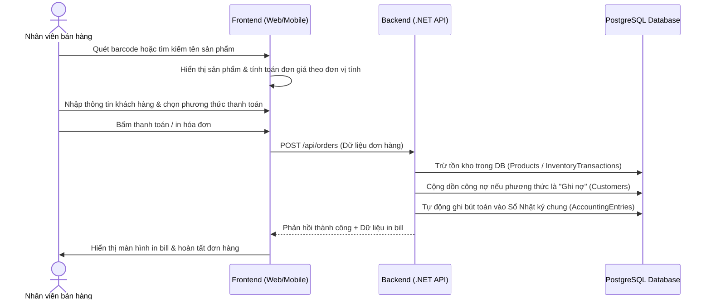
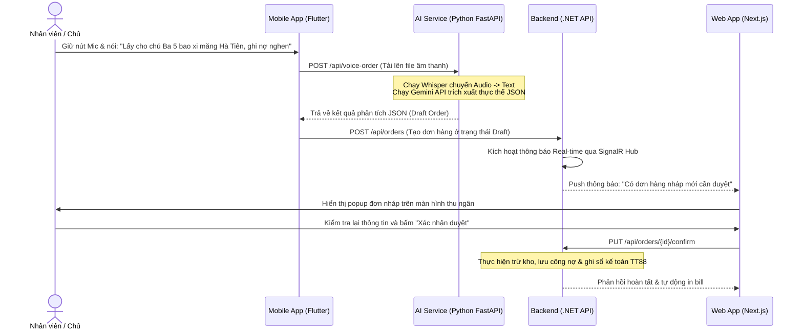

# Tài liệu Đặc tả Yêu cầu Hệ thống (System Requirements Specification - SRS)
## Dự án: BizFlow Platform

Tài liệu này đặc tả chi tiết các yêu cầu chức năng, phi chức năng, phân quyền người dùng và luồng nghiệp vụ của hệ thống **BizFlow Platform** (Hệ thống quản lý bán hàng thông minh tích hợp trợ lý AI và tự động hóa kế toán Thông tư 88/2021/TT-BTC).

---

## 1. Phân quyền Người dùng (User Roles & Permissions)

Hệ thống được thiết kế theo kiến trúc Multi-Tenant, phân tách dữ liệu độc lập giữa các hộ kinh doanh (Tenants). Người dùng được phân chia thành 3 nhóm quyền chính:

### 1.1. Nhân viên bán hàng (Employee)
Là người trực tiếp thao tác tại quầy thu ngân. Giao diện tối ưu cho tốc độ và tính chính xác cao.
*   **Đăng nhập hệ thống:** Xác thực tài khoản do Chủ cửa hàng cung cấp trong phạm vi Tenant của mình.
*   **Tạo đơn hàng tại quầy (POS):** Lọc sản phẩm nhanh bằng mã vạch (Barcode), tên viết tắt hoặc phím tắt. Chọn số lượng, đơn vị tính quy đổi (Lon/Lốc/Thùng) và gán khách hàng (nếu có).
*   **Ghi nợ (Debt Record):** Chọn hình thức thanh toán "Ghi nợ" đối với các khách hàng thân thiết đã có tên trong hệ thống. Hệ thống sẽ tự động cập nhật số dư nợ mới vào hồ sơ khách hàng.
*   **In hóa đơn:** Xem trước hóa đơn bán hàng và kết nối với máy in bill nhiệt hoặc xuất file hóa đơn định dạng PDF.
*   **Xác nhận đơn hàng AI (Draft Orders):** Nhận thông báo thời gian thực khi Trợ lý AI tạo đơn hàng nháp từ giọng nói/văn bản. Xem lại chi tiết mặt hàng, số lượng và bấm **Xác nhận** (để trừ kho và in bill) hoặc **Hủy/Sửa đổi**.

### 1.2. Chủ cửa hàng (Store Owner)
Quyền quản trị cao nhất cấp chi nhánh/hộ kinh doanh. Kế thừa toàn quyền của Nhân viên bán hàng, cộng thêm:
*   **Quản lý danh mục hàng hóa:** Thêm, sửa, xóa sản phẩm. Cấu hình nhiều đơn vị tính cho cùng một mặt hàng (Ví dụ: Bia Saigon có đơn vị cơ bản là "Lon", đơn vị quy đổi là "Két" = 24 lon hoặc "Lốc" = 6 lon) cùng với đơn giá tương ứng.
*   **Quản lý kho hàng:** Tạo phiếu nhập kho hàng loạt, cập nhật số lượng tồn kho thực tế, xem lịch sử chi tiết nhập xuất tồn của từng sản phẩm.
*   **Quản lý thông tin khách hàng & Công nợ:** Thêm mới khách hàng, theo dõi lịch sử mua hàng, tổng nợ hiện tại, ghi nhận phiếu thu tiền trả nợ của khách hàng và xem nhật ký thu nợ.
*   **Xem báo cáo quản trị (Dashboard):** Xem biểu đồ thống kê doanh thu theo ngày/tuần/tháng, thống kê sản phẩm bán chạy nhất, cảnh báo sản phẩm sắp hết hạn/hết hàng trong kho, tổng nợ phải thu.
*   **Quản lý nhân sự:** Tạo tài khoản cho nhân viên thu ngân, đổi mật khẩu, kích hoạt/khóa tài khoản nhân viên. Xem nhật ký hoạt động (Audit logs) của nhân viên để tránh gian lận.

### 1.3. Quản trị viên nền tảng (Platform Administrator)
Người vận hành toàn bộ hệ thống SaaS BizFlow.
*   **Quản lý Hộ kinh doanh (Tenants):** Phê duyệt đăng ký tài khoản Owner mới, khóa/mở khóa các hộ kinh doanh vi phạm điều khoản hoặc hết hạn thuê bao.
*   **Quản lý Bảng giá dịch vụ:** Cấu hình thông tin các gói cước thuê bao (Basic, Pro, Enterprise) và thời hạn sử dụng.
*   **Báo cáo tổng quan hệ thống:** Dashboard giám sát lượng Tenant hoạt động, lượng giao dịch toàn hệ thống và biểu đồ doanh thu thuê bao.
*   **Cấu hình hệ thống & Cập nhật Pháp lý:** Cập nhật các biểu mẫu báo cáo tài chính của nhà nước (đặc biệt là các thay đổi liên quan đến **Thông tư 88/2021/TT-BTC**) để áp dụng đồng bộ cho toàn bộ các hộ kinh doanh trên hệ thống.

---

## 2. Hệ thống ngầm & Trí tuệ nhân tạo (System AI & Auto-Bookkeeping)

### 2.1. Bộ xử lý trợ lý AI (AI Engine)
*   **Nhận diện giọng nói tiếng Việt (Speech-to-Text):** Nhận luồng âm thanh dạng ghi âm từ ứng dụng Mobile của nhân viên, sử dụng mô hình Whisper (đã được tinh chỉnh cho tiếng Việt và tiếng địa phương) để chuyển đổi thành văn bản thô.
*   **Trích xuất thực thể (Entity Extraction):** Sử dụng Gemini API phân tích văn bản thô để bóc tách thông tin:
    *   *Khách hàng:* Tìm kiếm tên khách hàng có sẵn (Ví dụ: "Chú Ba").
    *   *Sản phẩm & Số lượng:* Nhận diện tên sản phẩm và số lượng tương ứng (Ví dụ: "5 bao xi măng Hà Tiên").
    *   *Hình thức thanh toán:* Phân tích xem giao dịch có phải là ghi nợ hay không (Ví dụ: "ghi nợ nghen").
*   **Khởi tạo đơn nháp (Draft Order Creation):** Tự động điền dữ liệu đã trích xuất vào API tạo đơn nháp của backend.

### 2.2. Tự động hóa sổ sách kế toán (Thông tư 88/2021/TT-BTC)
Mỗi khi một hóa đơn bán hàng hoặc phiếu nhập kho được xác nhận thành công, hệ thống ngầm sẽ tự động hạch toán trực tiếp vào 3 loại sổ sách kế toán bắt buộc:
1.  **Sổ chi tiết doanh thu bán hàng hóa và dịch vụ (Mẫu số S1-ĐH):** Tự động điền ngày tháng, số hiệu chứng từ hóa đơn, tên hàng hóa, đơn vị tính, số lượng, đơn giá và tổng doanh thu vào đúng cột danh mục thuế suất tương ứng.
2.  **Sổ chi tiết vật liệu, dụng cụ, sản phẩm, hàng hóa (Mẫu số S2-ĐH):** Tự động ghi tăng/giảm số lượng và giá trị vật tư khi có phiếu nhập kho hoặc hóa đơn bán hàng để theo dõi tồn kho tức thời.
3.  **Sổ chi phí sản xuất, kinh doanh (Mẫu số S3-ĐH):** Tự động phân loại các khoản chi của hộ kinh doanh (Chi phí nhân công, Thuế phải nộp, Chi phí mua nguyên vật liệu) từ các phiếu chi/nhập kho vào các cột chi phí tương ứng theo quy định pháp luật.

---

## 3. Các Luồng Nghiệp vụ chính (Main Workflows)

### 3.1. Luồng Bán hàng thủ công tại quầy (POS Flow)

### 3.2. Luồng Bán hàng bằng Trợ lý AI (AI Voice Flow)

---

## 4. Yêu cầu Phi chức năng (Non-Functional Requirements)

*   **Multi-Tenancy:** Toàn bộ dữ liệu của từng hộ kinh doanh phải được phân tách triệt để bằng khóa `tenant_id`. Không cho phép bất kỳ truy vấn chéo nào giữa các Tenant.
*   **Hiệu năng phản hồi:** Các tác vụ cốt lõi (tìm kiếm sản phẩm, tạo hóa đơn, xác nhận đơn hàng) phải có thời gian phản hồi dưới **2000 ms**.
*   **Độ tin cậy của AI:** Hệ thống AI đóng vai trò trợ lý sinh đơn nháp. Người dùng bắt buộc phải có bước kiểm tra, chỉnh sửa và xác nhận thủ công trước khi đơn hàng được hạch toán chính thức để tránh sai lệch dữ liệu.
*   **Cơ chế dự phòng (Fail-safe):** Nếu dịch vụ AI (Python hoặc OpenAI/Gemini API) bị mất kết nối, toàn bộ hoạt động tạo hóa đơn thủ công tại quầy vẫn phải hoạt động bình thường mà không gây gián đoạn bán hàng.
*   **Tính pháp lý bền vững:** Toàn bộ sổ sách kế toán tự động sinh ra phải cam kết cập nhật 100% theo các văn bản sửa đổi bổ sung mới nhất của Bộ Tài chính Việt Nam.

---

## 5. Sản phẩm bàn giao đầu ra (Deliverables Checklist)

- [x] **Mã nguồn hệ thống:** Đầy đủ source code của 4 thành phần (Backend .NET 8, Frontend Next.js, AI Service Python, Mobile Flutter) được tổ chức trong thư mục Monorepo.
- [x] **Cơ sở dữ liệu:** File thiết kế [schema.sql](file:///c:/Users/nhata/Downloads/Project%20CV/schema.sql) và cấu hình Docker chạy PostgreSQL/Redis tự động.
- [x] **Tài liệu Hướng dẫn:** File [README.md](file:///c:/Users/nhata/BizFlow-Flatform/README.md) hướng dẫn cài đặt và chạy thử hệ thống local.
- [ ] **Tài liệu học thuật (Thesis/SRS Document):** Bản đặc tả này (`functional_specs.md`) có thể được trích xuất trực tiếp làm chương đặc tả yêu cầu trong báo cáo khóa luận tốt nghiệp.
